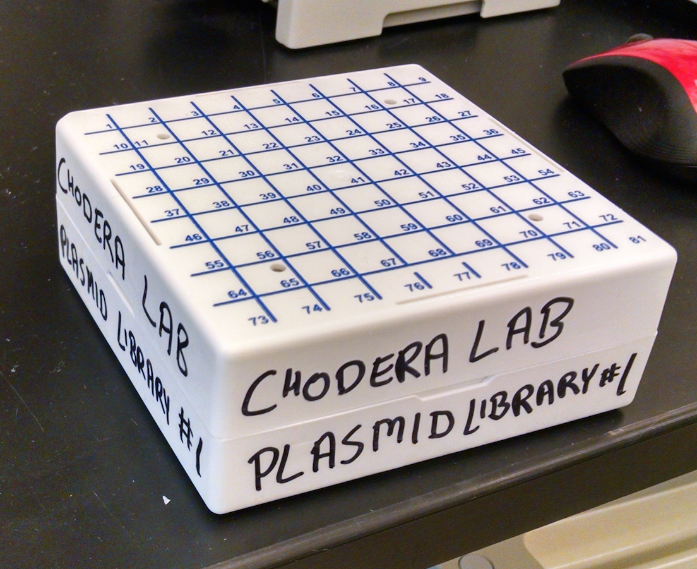
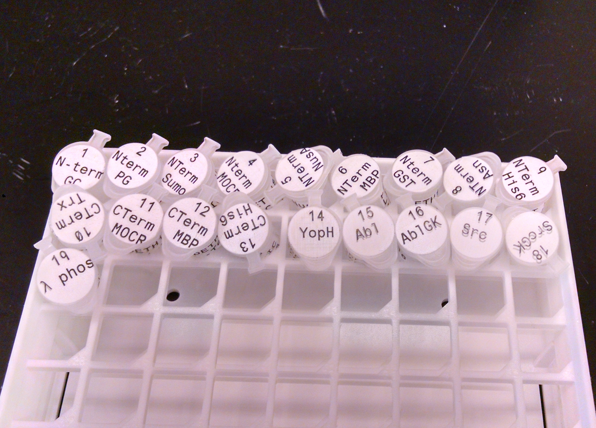

# PlasmidLibraryTools

Here we have the Chodera Lab Plasmid Library. It includes a csv, which is a download of the google spreadsheet in 'upkeep', and some tools to help analyze sequencing data.

`plasmid_sequences` - contains sequences for full plasmids

`scripts` - currently has `T7-Term-verify-sequence.ipynb` which has an example rough analysis of sequencing data compared to uniprot sequence 

`sequencing data by clone` - contains sequencing results by clone ID

---

This is the plasmid library:

